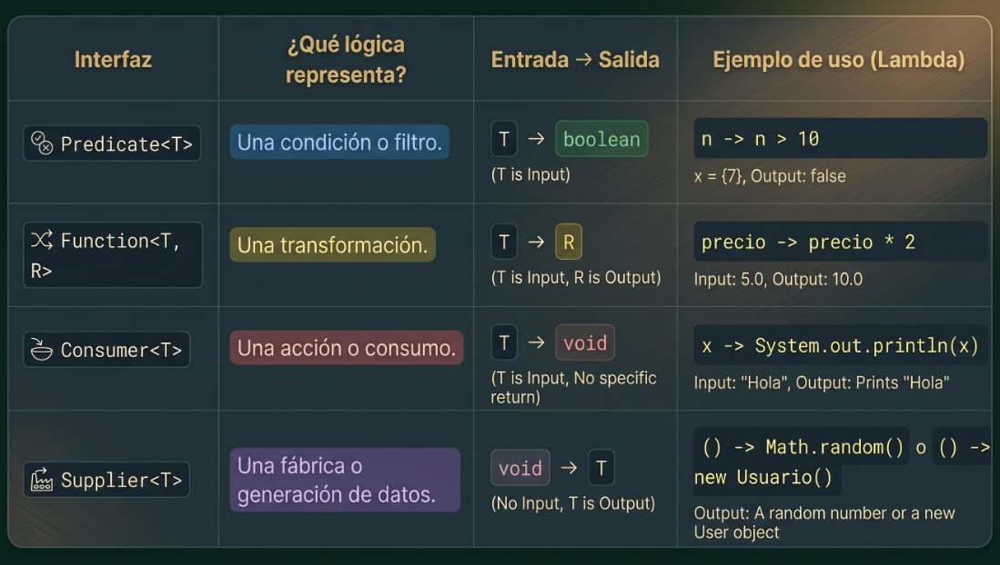

# Expresiones Lambdas en Java


## Las 4 interfaces clave para pasar lógica:
Dependiendo de qué tipo de lógica quieras pasar, Java te pide usar una "plantilla" (Interfaz Funcional) diferente en el parámetro:




# Métodos que activan las Interfaces Funcionales en Java

Cada interfaz funcional tiene un método principal que “dispara” o ejecuta la lógica de la lambda que recibe.

---

## 1. `Predicate<T>` se activa con `.test()`

Se utiliza para evaluar una condición y devolver `true` o `false`.

```java
public static boolean esAptoParaCredito(
        Cliente c,
        Predicate<Cliente> evaluacion) {

    // ¿Dónde se usa?:
    // En una condición o validación
    return evaluacion.test(c);
}
```

### Ejemplo de uso

```java
boolean resultado = esAptoParaCredito(
        cliente,
        c -> c.getEdad() >= 18
);
```
#### test $\rightarrow$ "Prueba" si este dato pasa el examen.

---

## 2. `Function<T, R>` se activa con `.apply()`

Se utiliza para transformar un dato en otro.

```java
public static String formatearId(
        Integer numero,
        Function<Integer, String> convertidor) {

    // ¿Dónde se usa?:
    // En asignaciones o retornos
    String idFormateado = convertidor.apply(numero);

    return idFormateado;
}
```

### Ejemplo de uso

```java
String codigo = formatearId(
        25,
        n -> "USR-" + n
);
```
#### apply $\rightarrow$ "Aplica" la transformación a este dato.
---

## 3. `Consumer<T>` se activa con `.accept()`

Se utiliza para ejecutar acciones sin retornar valores.

```java
public static void procesarReporte(
        Reporte rep,
        Consumer<Reporte> destino) {

    // ... se genera el reporte ...

    // ¿Dónde se usa?:
    // Como acción final sin retorno
    destino.accept(rep);
}
```

### Ejemplo de uso

```java
procesarReporte(
        reporte,
        r -> System.out.println(r)
);
```

---
#### accept $\rightarrow$ "Acepta" este objeto y haz lo que quieras con él.


## 4. `Supplier<T>` se activa con `.get()`

Se utiliza para generar o entregar objetos bajo demanda.

```java
public static Token obtenerTokenSeguridad(
        Supplier<Token> generador) {

    // ... si el token actual expiró ...

    // ¿Dónde se usa?:
    // Para crear u obtener objetos
    return generador.get();
}
```

### Ejemplo de uso

```java
Token token = obtenerTokenSeguridad(
        () -> new Token()
);
```
#### get $\rightarrow$ "Trae" u "Obtén" un objeto nuevo de la fábrica.
---

# Resumen rápido

| Interfaz | Método que ejecuta la lambda | ¿Qué hace? |
|---|---|---|
| `Predicate<T>` | `.test()` | Evalúa condiciones |
| `Function<T, R>` | `.apply()` | Transforma datos |
| `Consumer<T>` | `.accept()` | Ejecuta acciones |
| `Supplier<T>` | `.get()` | Genera u obtiene datos |


# Las 3 Reglas de Oro para escribir Lambdas en Java

Estas reglas ayudan a entender cuándo agregar o quitar elementos en una expresión lambda.

---

# 1. Los paréntesis del parámetro `()`

## Si hay un solo parámetro

No necesitas paréntesis.

```java
n -> n * 2
```

---

## Si hay cero parámetros

Los paréntesis son obligatorios.

```java
() -> System.out.println("Hola")
```

---

## Si hay más de un parámetro

También son obligatorios.

```java
(a, b) -> a + b
```

---

# 2. Las llaves `{ }`

##  Si la lógica cabe en una sola línea

No uses llaves.

```java
n -> n * 2
```

```java
x -> System.out.println(x)
```

---

## Si la lógica necesita varias líneas

Debes usar llaves.

```java
n -> {
    int resultado = n * 2;
    System.out.println(resultado);
}
```

---

# 3. La palabra `return`

##  Si la lambda tiene una sola línea

No escribas `return`.

Java devuelve el resultado automáticamente.

```java
n -> n * 2
```

---

##  Si usas llaves `{ }`

Entonces debes escribir `return`
(si la interfaz funcional devuelve un valor).

```java
n -> {
    int resultado = n * 2;
    return resultado;
}
```

---

# Ejemplo visual completo

## Lambda corta

```java
numero -> numero + 10
```

✔ Un parámetro  
✔ Sin paréntesis  
✔ Sin llaves  
✔ Sin return  

---

## Lambda larga

```java
(numero) -> {
    int resultado = numero + 10;
    return resultado;
}
```

✔ Usa paréntesis  
✔ Usa llaves  
✔ Usa return  
✔ Varias líneas de lógica  